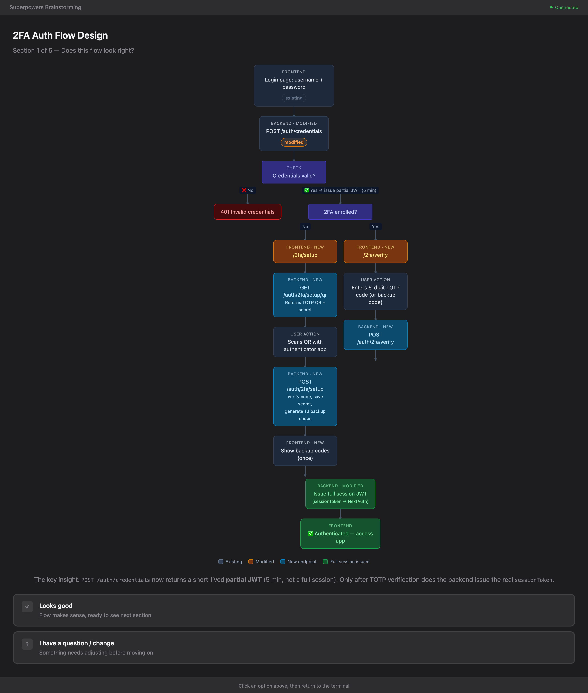
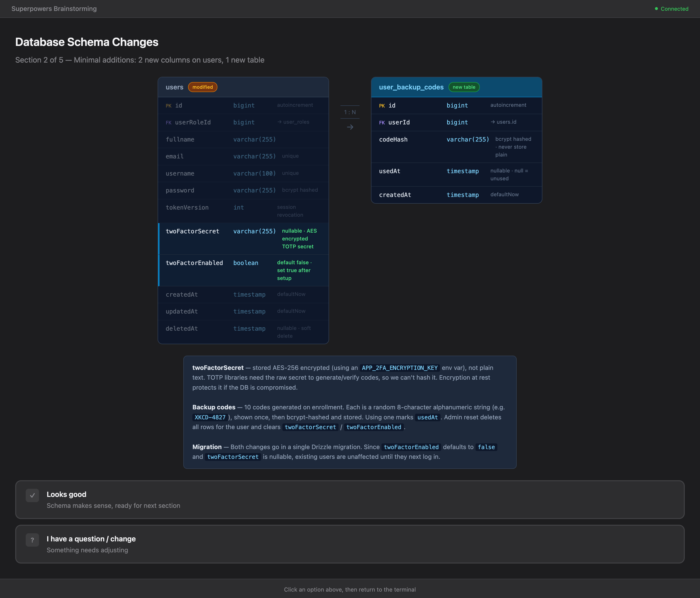
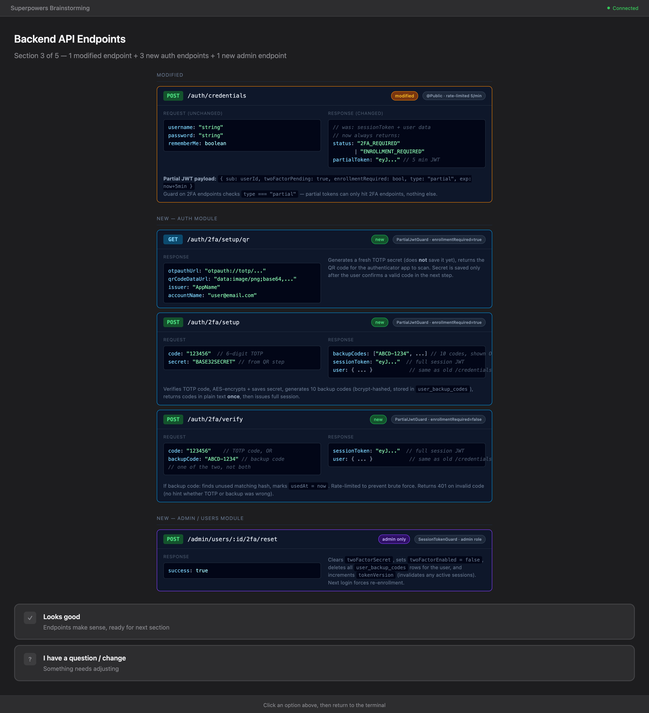
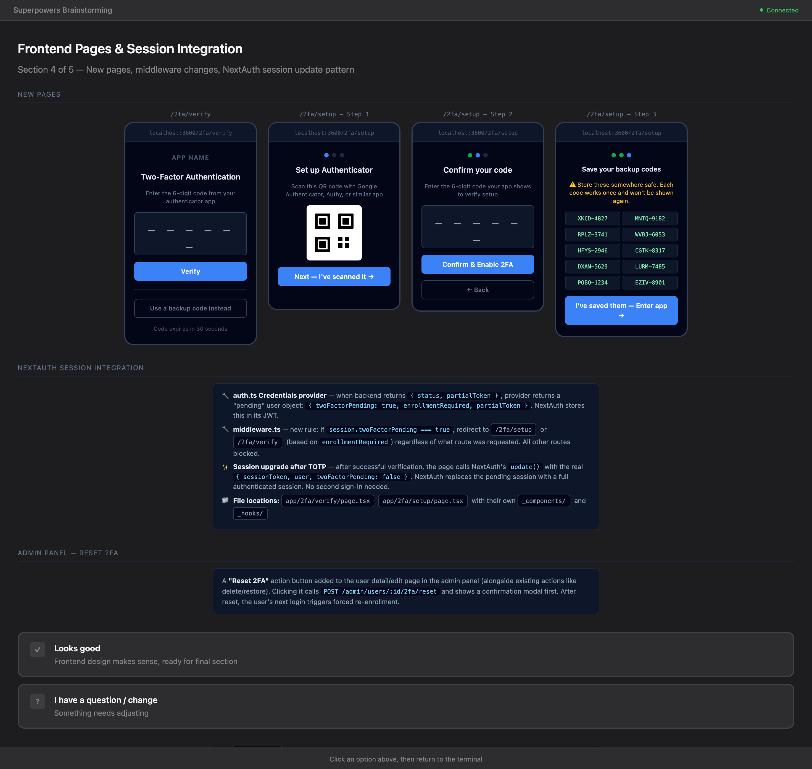
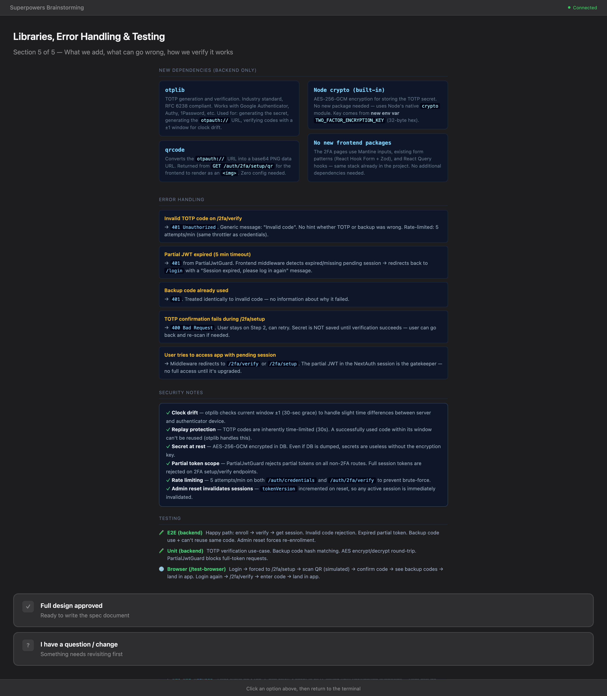

# 2FA Design Spec & Implementation Plan

Designing a complete TOTP-based Two-Factor Authentication system for a **Next.js 15 + NestJS 11** monorepo — from brainstorming to a 17-task implementation plan — using [Claude Code](https://docs.anthropic.com/en/docs/claude-code) with the [Superpowers](https://github.com/obra/superpowers) plugin.

## What's Inside

| Document | Description |
|----------|-------------|
| [Design Spec](docs/spec.md) | Full 2FA design — auth flow, database schema, API endpoints, frontend pages, security considerations |
| [Implementation Plan](docs/plan.md) | 17-task plan across 3 chunks (backend foundation, backend endpoints, frontend) with exact code |

## The Process

The entire design was produced through an interactive brainstorming session. Superpowers' **brainstorming skill** guided the conversation through clarifying questions, approach selection, and iterative design — presenting each section visually in a companion browser window for review before moving on.

After the spec was approved, the **writing-plans skill** generated a detailed implementation plan, which was then reviewed by parallel code-review agents that caught critical bugs (like `auth()` vs `getToken()` for reading JWT internals in Server Actions) before a single line of code was written.

### Brainstorming Flow

**1. Auth Flow Design** — Interactive flowchart showing the partial JWT to full session upgrade path

**2. Database Schema** — Schema changes to `users` table + new `user_backup_codes` table

**3. Backend API Endpoints** — Modified credentials endpoint + 3 new auth + 1 admin endpoint

**4. Frontend Pages & Session Integration** — 4 new pages, middleware changes, NextAuth session handling

**5. Libraries, Error Handling & Testing** — Dependencies, error cases, security notes, test plan

## Tools Used

- **[Claude Code](https://docs.anthropic.com/en/docs/claude-code)** (CLI) — Anthropic's agentic coding tool
- **[Superpowers](https://github.com/obra/superpowers)** — Claude Code plugin adding structured skills for brainstorming, planning, TDD, and more
- **Skills used:** `brainstorming`, `writing-plans`, `code-reviewer` (parallel agents)

## Key Design Decisions

- **TOTP-only** (no SMS/email) via `otplib` — simpler, more secure
- **Stateless partial JWT** — 5-minute token after credentials, upgraded to full session after TOTP
- **AES-256-GCM** encryption for TOTP secrets at rest
- **10 bcrypt-hashed backup codes** with atomic single-use redemption
- **Server Actions** keep the partial token server-side (never exposed to browser JS)
- **Forced enrollment** — all users must set up 2FA, no opt-out
